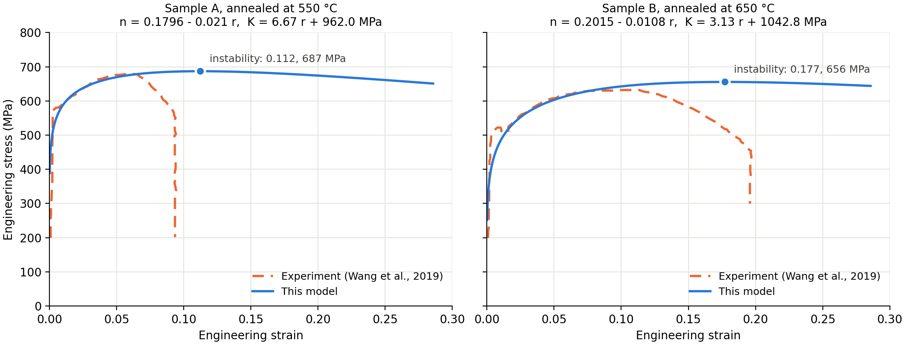

# Instability of functionally graded low-carbon steel

Code and data for the paper

> K. Amirian, Z. Abbasi, R. Ebrahimi, "Analytical and numerical instability analysis of functionally graded low-carbon steel," *International Journal of Iron and Steel Society of Iran* (2023). [doi:10.22034/ijissi.2023.1990580.1262](https://doi.org/10.22034/ijissi.2023.1990580.1262)

In a gradient-structured steel bar the grain size changes with radius, so the strain-hardening exponent *n* and the strength coefficient *K* change with radius too. This code simulates a tensile test on such a bar. It integrates the Hollomon flow stress over the shrinking cross-section to get the force, and takes the maximum force as the instability point, where necking starts.



## Model

The force on the bar is the Hollomon flow stress integrated over the current cross-section (Eq. 6 of the paper). As in the 2022 scripts, each ring keeps the *K* and *n* of the radius it had before the test:

$$F(t) = \int_{r_\mathrm{min}}^{R(t)} K(\rho)\, \varepsilon(t)^{\,n(\rho)}\, 2\pi r \, dr, \qquad \varepsilon(t) = \ln(1 + \dot\varepsilon t), \qquad R(t) = \frac{R_0}{\sqrt{1 + \dot\varepsilon t}}, \qquad \rho = \frac{r R_0}{R(t)}$$

The integral is evaluated with composite Simpson's rule. Engineering stress is $F/\pi R_0^2$, true stress is $F/\pi R^2$, and the instability point is the maximum of $F$.

| Case | *n*(*r*) | *K*(*r*) (MPa) | Paper figure |
|---|---|---|---|
| Homogeneous check | 0.3 | 100 | Figs. 1 to 3 |
| Sample A, annealed at 550 °C | 0.1796 − 0.021 *r* | 6.67 *r* + 962.023 | Fig. 6 |
| Sample B, annealed at 650 °C | 0.2015 − 0.0108 *r* | 3.13 *r* + 1042.7868 | Fig. 7 |

*r* is in mm and the bar radius is 5 mm. These are the coefficients used to make the figures; the paper prints them rounded (Eqs. 8 to 11).

## Results

Instability point from this code, next to the "Numerical" values reported in the paper:

| Case | | Eng. strain | UTS (MPa) | True strain | True stress (MPa) |
|---|---|---|---|---|---|
| Sample A | this code | 0.112 | 687.0 | 0.106 | 764.2 |
| | paper (Table 3) | 0.11 | 687 | 0.11 | 764 |
| Sample B | this code | 0.177 | 655.7 | 0.163 | 771.8 |
| | paper (Table 4) | 0.18 | 656 | 0.16 | 772 |
| Homogeneous | this code | 0.350 | 51.6 | 0.300 | 69.7 |
| | paper (Table 1) | | | 0.29 | |

For the homogeneous bar the instability should fall at true strain *n* = 0.3, and the code finds 0.300.

## Run it

Python 3 with NumPy and Matplotlib:

```bash
pip install -r requirements.txt
python python/reproduce_paper.py
python tests/test_against_original.py
```

MATLAB or GNU Octave, from the repository folder:

```matlab
run('matlab/reproduce_paper.m')
run('tests/test_against_original.m')
```

To try your own gradient, pass any functions of the undeformed radius (from the `python/` folder):

```python
from fgm_tensile import tensile_test

result = tensile_test(K=lambda r: 900 + 20 * r, n=lambda r: 0.25 - 0.02 * r,
                      v=0.025, L0=70.0, t_end=800.0)
print(result.instability())
```

## What is in this repository

| Path | Contents |
|---|---|
| `python/fgm_tensile.py` | The model, plus the three cases from the paper |
| `python/reproduce_paper.py` | Prints the results table and writes `figures/` |
| `matlab/fgm_tensile.m`, `matlab/paper_cases.m`, `matlab/reproduce_paper.m` | The same in MATLAB |
| `data/` | Grain size, microhardness and stress-strain data for samples A and B (see below) |
| `tests/` | Checks against the original scripts (the Python test also checks the paper's tables) |
| `original_2022/` | The original 2022 MATLAB scripts, unchanged |

## How this was checked

The original scripts in `original_2022/` (`numericFGM2.m`, `l550.m`, `l650.m`) were run unchanged in GNU Octave 8.4, with `syms` and the plotting calls replaced by empty stub functions (they do not affect the numbers), and their full output is stored in `tests/reference/`. The rewritten code reproduces every column of that output: the MATLAB function to within 2 × 10⁻¹⁶ relative difference, and the Python version to within 4 × 10⁻¹⁴. The outputs of `l550.m` and `l650.m` that were saved in 2022 for the paper's figures agree with the Octave rerun to within 5 × 10⁻¹⁵.

## Notes

- Eq. (6) integrates from *r* = 0. The 2022 scripts for samples A and B start at *r* = 0.5 mm, and this repository keeps that (`r_min`) so the numbers match the paper. Starting at 0 raises the UTS by about 1%: from 687.0 to 693.6 MPa for sample A, and from 655.7 to 663.0 MPa for sample B.
- `original_2022/numericFGM2.m` starts the homogeneous check at 0 and gives a true strain of 0.300. Started at 0.5 mm, the same check gives 0.296, the value quoted in the paper's text.
- The scripts use a strain rate of 0.000357 s⁻¹, which is 1.5 mm/min over a 70 mm gauge length, rounded.

## Data

The files in `data/` were digitized from the figures of L. Wang et al., "Optimizing mechanical properties of gradient-structured low-carbon steel by manipulating grain size distribution," *Materials Science and Engineering A* 743 (2019) 309–313. Sample A is the specimen annealed at 550 °C and sample B the one annealed at 650 °C. Values are as digitized, so small artifacts remain (for example, *r*/*R* slightly below 0 near the centre). For exact values, use the original paper. These data are not covered by the code license.

| File | Columns |
|---|---|
| `wang2019_grain_size.csv` | `sample`, `r_over_R`, `ferrite_grain_size_um` |
| `wang2019_microhardness.csv` | `sample`, `r_over_R`, `vickers_HV` |
| `wang2019_stress_strain.csv` | `sample`, `eng_strain`, `eng_stress_MPa` |

## Citation

```bibtex
@article{amirian2023instability,
  author  = {Amirian, Kiyan and Abbasi, Zahra and Ebrahimi, Ramin},
  title   = {Analytical and numerical instability analysis of functionally graded low-carbon steel},
  journal = {International Journal of Iron and Steel Society of Iran},
  year    = {2023},
  doi     = {10.22034/ijissi.2023.1990580.1262}
}
```

## License

Code: MIT, see `LICENSE`.
