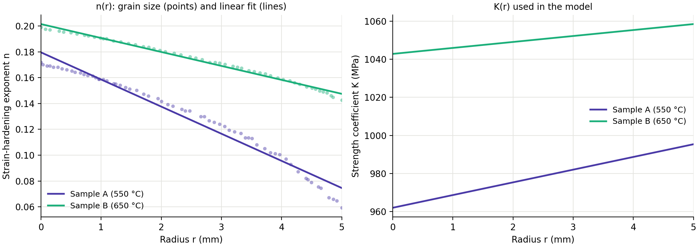
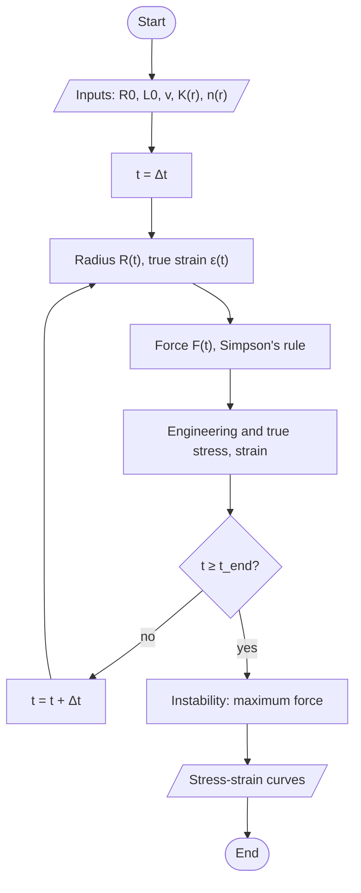
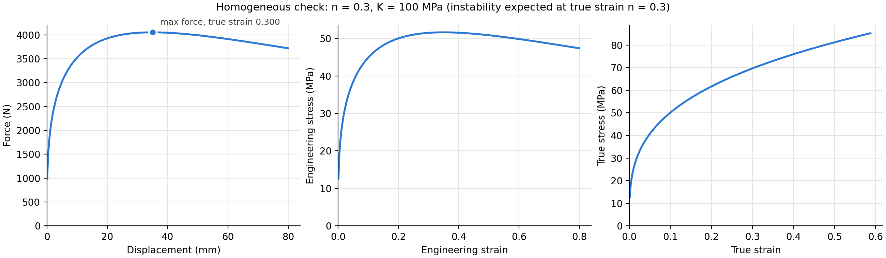

# Instability of functionally graded low-carbon steel

Code and data for the paper

> K. Amirian, Z. Abbasi, R. Ebrahimi, "Analytical and numerical instability analysis of functionally graded low-carbon steel," *International Journal of Iron and Steel Society of Iran* (2023). [doi:10.22034/ijissi.2023.1990580.1262](https://doi.org/10.22034/ijissi.2023.1990580.1262)

Functionally graded materials (FGMs) are engineered so that their properties change smoothly and continuously from one surface to the other. In a gradient-structured low-carbon steel bar the ferrite grain size changes with radius, so the strain-hardening exponent *n* and the strength coefficient *K* change with radius too. This repository simulates a tensile test on such a bar and predicts its stress-strain curve and its instability point, where necking starts.

The main finding is that the bar becomes unstable at a true strain close to the cross-section average of *n*. In other words, Considère's criterion (necking at true strain *n*) holds for these graded bars with *n* replaced by its average over the cross-section.


## Method

### 1. Radial property profiles

The hardening exponent follows from the ferrite grain size *d* (in µm) through $n = 0.307 - 0.439\, d^{-1/2}$ (Eq. 7 of the paper, based on Qiu et al., 2012). Applied to the measured grain-size distribution, it gives *n* at each radius, and a linear fit gives *n*(*r*). The strength coefficient *K*(*r*) is obtained from the microhardness profile across the bar.



| Sample | *n*(*r*) | *K*(*r*) (MPa) |
|---|---|---|
| A, annealed at 550 °C | 0.1796 − 0.021 *r* | 6.67 *r* + 962.023 |
| B, annealed at 650 °C | 0.2015 − 0.0108 *r* | 3.13 *r* + 1042.7868 |

*r* is in mm; the bar radius is 5 mm.

### 2. Simulated tensile test

The bar is pulled at a constant crosshead speed *v* over a gauge length *L*₀. With uniform deformation and constant volume, the true strain and the bar radius at time *t* are

$$\varepsilon(t) = \ln\left(1 + \frac{v t}{L_0}\right), \qquad R(t) = \frac{R_0}{\sqrt{1 + v t / L_0}}$$

Each ring of material keeps the *K* and *n* of the radius $\rho = r R_0 / R(t)$ it had before the test, and follows the Hollomon law $\sigma = K \varepsilon^{n}$. The axial force is the flow stress integrated over the current cross-section,

$$F(t) = \int_{r_\mathrm{min}}^{R(t)} K(\rho)\, \varepsilon(t)^{\,n(\rho)}\, 2\pi r \, dr$$

which is evaluated with composite Simpson's rule. For samples A and B the integral starts at $r_\mathrm{min}$ = 0.5 mm, which reproduces the paper's Tables 3 and 4. The engineering stress is $F/\pi R_0^2$ and the true stress is $F/\pi R(t)^2$.



The time step is Δ*t* = 0.5 s. Samples A and B use *v* = 1.5 mm/min and *L*₀ = 70 mm, so *v*/*L*₀ = 0.000357 s⁻¹.

### 3. Instability point

Necking starts when the force reaches its maximum: beyond it, work hardening can no longer make up for the shrinking cross-section. For a homogeneous bar this happens at a true strain equal to *n* (Considère's criterion). For the graded bars it is compared with the cross-section average

$$\bar n = \frac{1}{\pi R_0^2} \int_0^{R_0} n(r)\, 2\pi r \, dr$$

## Results

| | Sample A (550 °C) | Sample B (650 °C) |
|---|---|---|
| Cross-section average *n̄* | 0.110 | 0.166 |
| True strain at instability | 0.106 | 0.163 |
| Engineering strain at instability | 0.112 | 0.177 |
| Ultimate tensile strength (MPa) | 687.0 | 655.7 |
| True stress at instability (MPa) | 764.2 | 771.8 |

The true strain at instability is within 0.004 of *n̄* for both samples, and the values match Tables 3 and 4 of the paper. As a check, a homogeneous bar with *n* = 0.3 and *K* = 100 MPa becomes unstable at a true strain of 0.300, as Considère's criterion requires.



## Run it

Python 3 with NumPy and Matplotlib:

```bash
pip install -r requirements.txt
python python/reproduce_paper.py
python tests/test_regression.py
```

MATLAB or GNU Octave, from the repository folder:

```matlab
run('matlab/reproduce_paper.m')
run('tests/test_regression.m')
```

To simulate your own gradient, pass any functions of the radius (from the `python/` folder):

```python
from fgm_tensile import tensile_test

# r in mm, K in MPa, v in mm/s, L0 in mm, t_end in s
result = tensile_test(K=lambda r: 900 + 20 * r, n=lambda r: 0.25 - 0.02 * r,
                      v=0.025, L0=70.0, t_end=800.0)
print(result.instability())
```

## Repository structure

| Path | Contents |
|---|---|
| `python/fgm_tensile.py` | The model, plus the cases from the paper |
| `python/reproduce_paper.py` | Prints the results and writes the figures in `figures/` |
| `matlab/` | The same model in MATLAB, with a script for the stress-strain figures |
| `data/` | Grain size, microhardness and stress-strain data for samples A and B |
| `tests/` | Regression tests against reference outputs of the original implementation |

## Data

The files in `data/` were digitized from the figures of L. Wang et al., "Optimizing mechanical properties of gradient-structured low-carbon steel by manipulating grain size distribution," *Materials Science and Engineering A* 743 (2019) 309–313. They are not covered by the code license.

| File | Columns |
|---|---|
| `wang2019_grain_size.csv` | `sample`, `r_over_R`, `ferrite_grain_size_um` |
| `wang2019_microhardness.csv` | `sample`, `r_over_R`, `vickers_HV` |
| `wang2019_stress_strain.csv` | `sample`, `eng_strain`, `eng_stress_MPa` |

## References

- H. Qiu, L. N. Wang, T. Hanamura, S. Torizuka, "Prediction of the work-hardening exponent for ultrafine-grained steels," *Materials Science and Engineering A* 536 (2012) 269–272.
- L. Wang et al., *Materials Science and Engineering A* 743 (2019) 309–313 (see Data).

## Citation

```bibtex
@article{amirian2023instability,
  author  = {Amirian, Kiyan and Abbasi, Zahra and Ebrahimi, Ramin},
  title   = {Analytical and numerical instability analysis of functionally graded low-carbon steel},
  journal = {International Journal of Iron and Steel Society of Iran},
  year    = {2023},
  doi     = {10.22034/ijissi.2023.1990580.1262}
}
```

## License

Code: MIT, see `LICENSE`.
